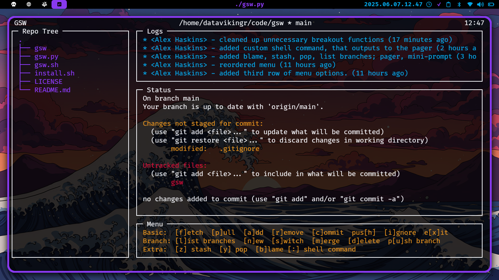

# gsw - git status watch v 3.0!!

gsw is a fully featured tui-based HUD for your git repos while you code. Think of it as similar to top/htop for git repo management. 



## Features:
- install.sh handles dependancies (git, tree) for you, and copies the gsw binary into /usr/bin/
- git status, git logs, working directory sidebar, branch in HUD
- typical git workflow: add/commit, push, pull, rm, branch management, .gitignore, stash/pop, blame
- : hotkey - to run arbitrary shell commands without leaving the HUD (try it out with `git remote -v` or your favorite super-verbose alias of ls!)
- Flag Arguments:
  - -t: customize refresh rate (default 10s)
  - -r: custom repo filepath path (default current directory)
  - -l: customize number of log entries in HUD (default 5)

## TODO:
- ~add git branch mechanics~
- ~add update check to gsw.sh~
- ~branch management~
- ~curses TUI to prevent screen flicker~

## Install (or Update)
Navigate to your code directory (usually ~/src or ~/code). Then run:
```
git clone https://github.com/datavikingr/gsw
cd gsw
./install.sh
```

That's it! Thanks for chosing gsw!!
